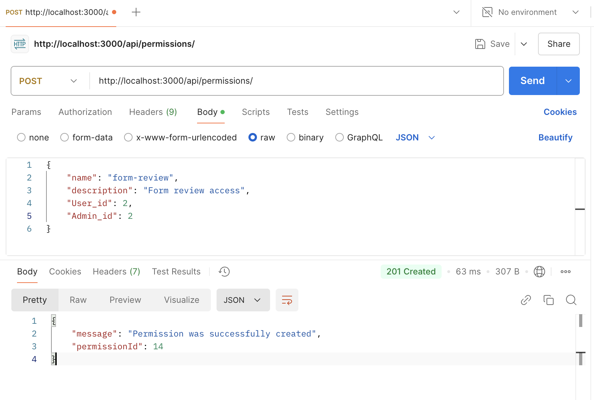
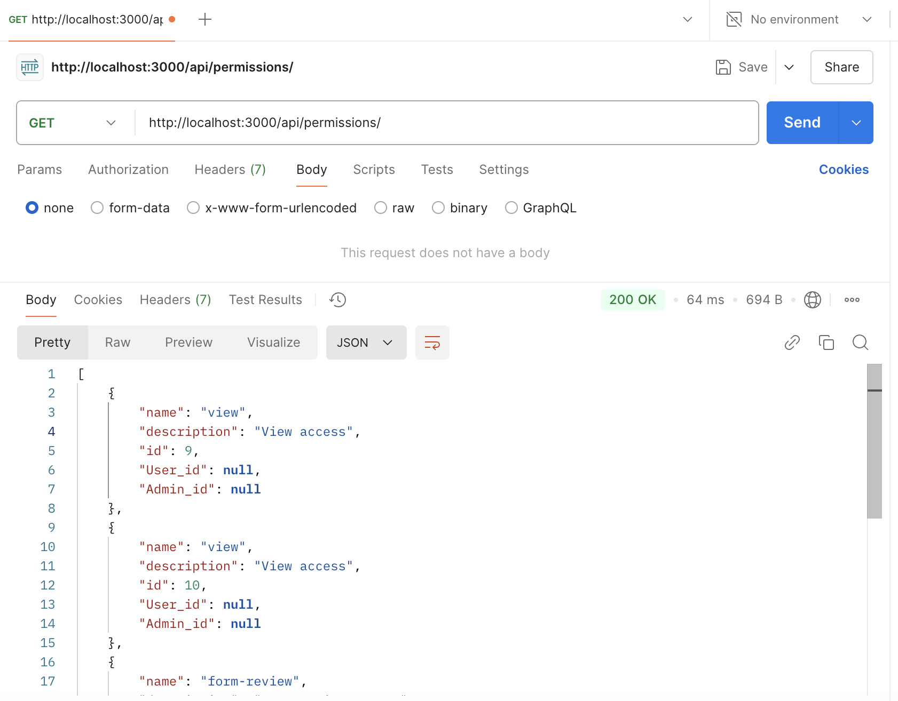
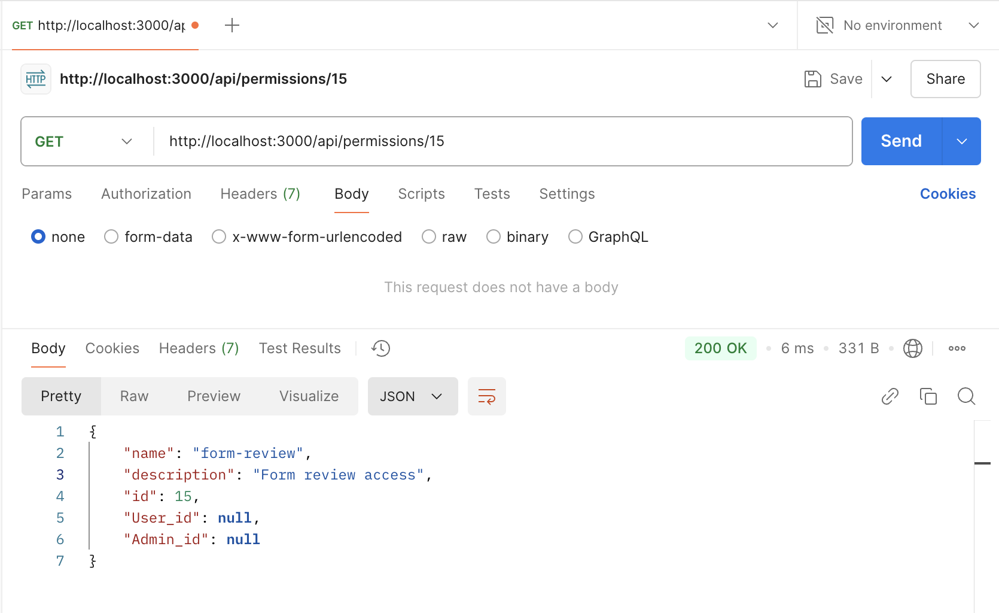
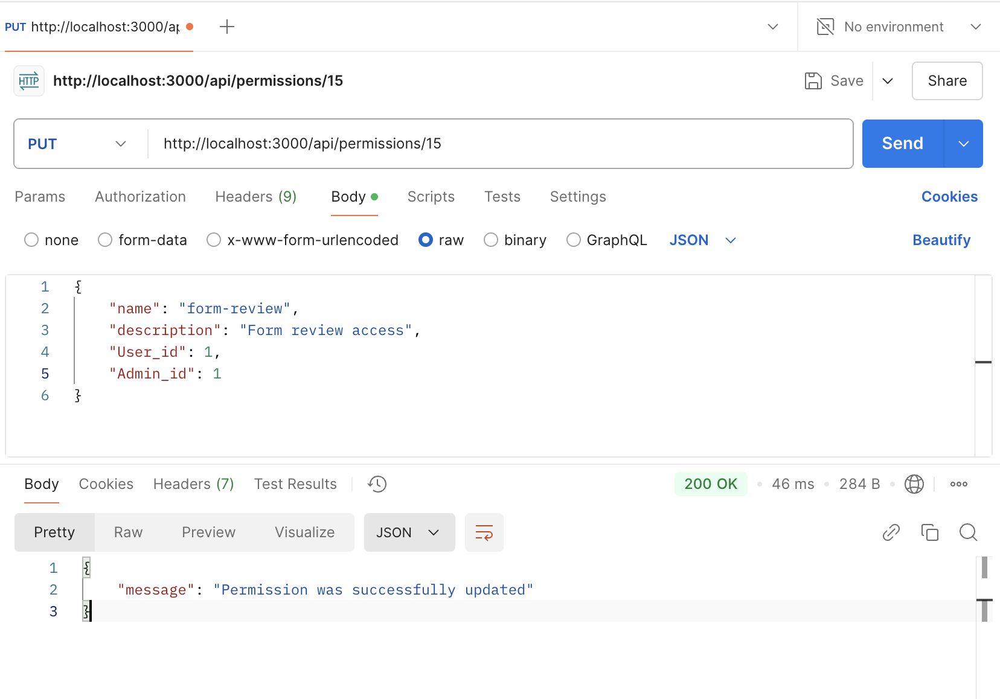
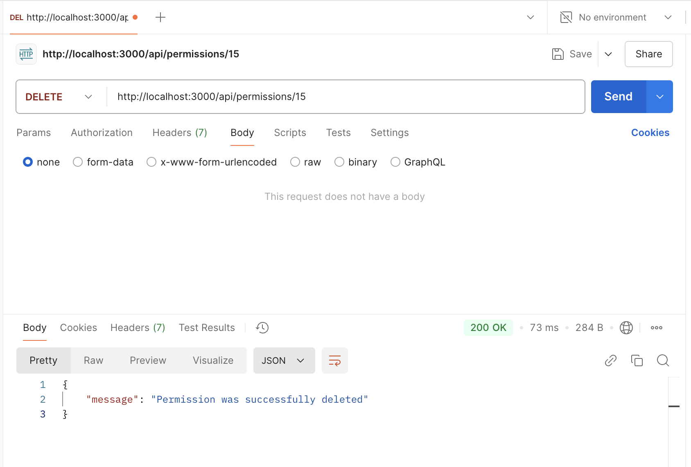

# Тестування працездатності системи

Розробка CRUD-сервісу для управління нашою базою даних - а саме блоком доступів (Permissions)

### Вихідні коди програми

- server.js

```javascript
const express = require("express");
const dotenv = require("dotenv");
const permissionRoutes = require("./routes/permissionRoutes");

dotenv.config();

const app = express();
app.use(express.json());
app.use("/api/permissions", permissionRoutes);

const PORT = 3000;
app.listen(PORT, () => {
  console.log(`Server is running on http://localhost:${PORT}`);
});
```

- config/db.js

```javascript
require("dotenv").config();
const mysql = require("mysql2");

const connection = mysql.createConnection({
  host: process.env.DB_HOST,
  user: process.env.DB_USER,
  password: process.env.DB_PASSWORD,
  database: process.env.DB_NAME,
});

connection.connect((err) => {
  if (err) {
    console.error("Error while connecting to the database: ", err);
    return;
  }
  console.log("Successfully connected");
});

module.exports = connection;
```

- controllers/permissionController.js

```javascript
const db = require("../config/db");

exports.createPermission = (req, res) => {
  const { name, description, user_id, admin_id } = req.body;
  const query =
    "INSERT INTO Permission (name, description, User_id, Admin_id) VALUES (?, ?, ?, ?)";
  db.query(query, [name, description, user_id, admin_id], (err, result) => {
    if (err) {
      res
        .status(500)
        .json({ error: "Error while creating Permission", details: err });
    } else {
      res.status(201).json({
        message: "Permission was successfully created",
        permissionId: result.insertId,
      });
    }
  });
};

exports.getPermissions = (req, res) => {
  const query = "SELECT * FROM Permission";
  db.query(query, (err, results) => {
    if (err) {
      res
        .status(500)
        .json({ error: "Error while getting Permission", details: err });
    } else {
      res.status(200).json(results);
    }
  });
};

exports.getPermissionById = (req, res) => {
  const { id } = req.params;
  const query = "SELECT * FROM Permission WHERE id = ?";
  db.query(query, [id], (err, result) => {
    if (err) {
      res
        .status(500)
        .json({ error: "Error while getting Permission by id", details: err });
    } else if (result.length === 0) {
      res.status(404).json({ message: "Permission was not found" });
    } else {
      res.status(200).json(result[0]);
    }
  });
};

exports.updatePermission = (req, res) => {
  const { id } = req.params;
  const { name, description, user_id, admin_id } = req.body;
  const query =
    "UPDATE Permission SET name = ?, description = ?, User_id = ?, Admin_id = ? WHERE id = ?";
  db.query(query, [name, description, user_id, admin_id, id], (err, result) => {
    if (err) {
      res
        .status(500)
        .json({ error: "Error while updating Permission", details: err });
    } else if (result.affectedRows === 0) {
      res.status(404).json({ message: "Permission was not found" });
    } else {
      res.status(200).json({ message: "Permission was successfully updated" });
    }
  });
};

exports.deletePermission = (req, res) => {
  const { id } = req.params;
  const query = "DELETE FROM Permission WHERE id = ?";
  db.query(query, [id], (err, result) => {
    if (err) {
      res
        .status(500)
        .json({ error: "Error while deleting Permission", details: err });
    } else if (result.affectedRows === 0) {
      res.status(404).json({ message: "Permission was not found" });
    } else {
      res.status(200).json({ message: "Permission was successfully deleted" });
    }
  });
};
```

- routes/permissionRoutes.js

```javascript
const express = require("express");
const router = express.Router();
const {
  createPermission,
  getPermissions,
  getPermissionById,
  updatePermission,
  deletePermission,
} = require("../controllers/permissionController");

//creating permission
router.post("/", createPermission);

//getting all permissions
router.get("/", getPermissions);

//getting certain permission
router.get("/:id", getPermissionById);

//changing certain permission
router.put("/:id", updatePermission);

//deleting certain permission
router.delete("/:id", deletePermission);

module.exports = router;
```

### Скріншоти тестування запитів у Postman

- POST



- GET ALL



- GET BY ID



- PUT



- DELETE


